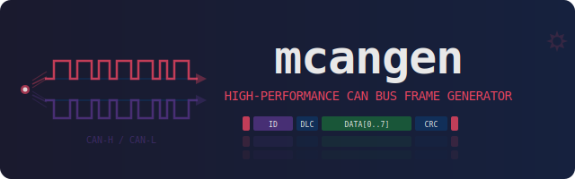

<p align="center">
  
</p>

# mcangen

[](https://github.com/mickeyl/mcangen/actions/workflows/ci.yml)
[](https://github.com/mickeyl/mcangen/actions/workflows/release.yml)
[](LICENSE)
[](https://crates.io/crates/mcangen)


High-performance CAN bus frame generator for Linux, built in Rust.

## Why?

If you develop or test anything that touches a CAN bus — automotive ECUs,
J2534 passthru devices, OBD adapters, SocketCAN drivers, or CAN-to-IP
gateways — you need a way to throw traffic at it. The venerable `cangen`
from [can-utils](https://github.com/linux-can/can-utils) works, but it has
limitations:

- It can't hit high frame rates reliably — timing drifts at scale.
- Mixing standard and extended IDs in one run requires scripting.
- There's no built-in way to send an exact number of frames and stop, which
  makes automated test scripts awkward.
- There's no sequence-number mode to detect drops or reordering on the
  receiving end.

**mcangen** fixes all of that. It uses raw SocketCAN writes, a hybrid
sleep/busy-spin rate limiter, and a fast xorshift PRNG to generate diverse
CAN traffic at line rate or any precise target FPS — then stops at exactly
the count you asked for.

Typical use cases:

- **Benchmarking** a CAN interface, driver, or J2534 device at maximum
  throughput.
- **Stress testing** a receiver to find buffer overflows, dropped frames,
  or firmware crashes.
- **Verifying frame counts** — send exactly *N* frames, compare what
  arrived on the other side. (Hint: if your device counts a few more than
  you sent, that's CAN bus retransmissions from arbitration losses — not a
  bug.)
- **Regression testing** with reproducible traffic — same seed, same
  frames every time.

## Features

- **Fast** — raw SocketCAN writes with zero-copy framing, release build
  with LTO, single-threaded hot loop
- **All frame types** — standard (11-bit) IDs, extended (29-bit) IDs, or a
  random mix of both
- **Configurable DLC** — any range from 0 to 8 bytes
- **Data patterns** — random, zeros, ones (0xFF), incrementing counter,
  64-bit big-endian sequence number, or CANcorder quality-test protocol
- **UDS flash simulation** — realistic ECU reprogramming session with
  proper ISO-TP framing, security access, memory erase, firmware transfer,
  DTC handling, and ECU reset — both tester and ECU sides on the bus
- **Burst mode** — alternating high/low rate phases to emulate ECU
  reprogramming traffic patterns
- **Precise rate control** — hybrid sleep/busy-spin for accurate FPS
  targeting from 1 fps to line rate
- **Exact counts** — send a precise number of frames then stop
- **Reproducible** — seed the PRNG for deterministic, repeatable runs
- **Minimal dependencies** — just `clap`, `libc`, `nix`, and `fastrand`

## Requirements

- Linux with SocketCAN support (kernel 2.6.25+)
- Rust stable toolchain (1.70+)
- `CAP_NET_RAW` capability or root access

## Building

```bash
make build
```

Or directly with Cargo:

```bash
cargo build --release
```

The binary is at `target/release/mcangen`.

## Installation

From crates.io:

```bash
cargo install mcangen
```

From source:

```bash
make install                # installs to ~/.local/bin and man page
```

Or to a system-wide location:

```bash
make install PREFIX=/usr/local
```

## Usage

```
mcangen [OPTIONS] <INTERFACE>
```

### Examples

**Blast a million frames as fast as possible and report progress:**

```bash
mcangen can0 -r 0 -n 1000000 -p 100000
```

**Send at exactly 500 fps with mixed standard and extended IDs:**

```bash
mcangen can0 -r 500 --id-kind mixed -n 5000
```

**Walk through every standard ID sequentially, fixed DLC of 4:**

```bash
mcangen can0 --id-mode sequential --id-min 0x000 --id-max 0x7FF \
    --dlc-min 4 --dlc-max 4 -n 2048
```

**Use sequence numbers to detect drops on the receiver:**

```bash
mcangen can0 -n 50000 -r 10000 --data-mode sequence
```

On the receiving end, decode the 8 payload bytes as a big-endian u64.
Any gap in the sequence means a dropped frame.

**Reproducible test run (same seed = same frames):**

```bash
mcangen can0 -n 5000 -r 1000 --seed 42
```

**Extended IDs only, random data, no rate limit:**

```bash
mcangen can0 --id-kind extended -r 0 -n 100000
```

**UDS flash simulation — realistic ECU reprogramming session on the bus:**

```bash
mcangen vcan0 --uds-flash -n 1
```

Generates a full 16-phase UDS reprogramming session: diagnostic session
control, ECU identification reads, security access (seed/key), memory
erase with pending responses, multi-frame ISO-TP firmware transfer
(50–150 blocks), DTC read/clear/verify, and ECU reset. Both tester and
ECU frames appear on the bus with realistic timing.

```bash
# Double speed, fixed 100 blocks, no error injection
mcangen can0 --uds-flash -n 1 --speed 2.0 --transfer-blocks 100 --no-errors

# Loop forever with OBD-II polling between sessions
mcangen vcan0 --uds-flash

# Custom arbitration IDs, skip inter-session OBD traffic
mcangen can0 --uds-flash --tester-id 0x641 --ecu-id 0x642 --no-obd -n 3
```

In UDS flash mode, `-n` sets the number of sessions (0 = loop forever).
Between sessions, OBD-II polling traffic (PIDs on 0x7DF) is generated
with drifting vehicle state unless `--no-obd` is given.

**Burst mode — simulate ECU reprogramming traffic pattern:**

```bash
mcangen can0 --burst -n 100000
```

Default cycle: 2 s at 5000 fps, then 500 ms at 50 fps, repeating.
Customise with `--burst-high-rate`, `--burst-low-rate`, `--burst-high-ms`,
`--burst-low-ms`.

**CANcorder quality-test protocol on a fixed ID:**

```bash
mcangen can0 --data-mode quality-test --id-min 0x7E0 --id-max 0x7E0 -r 1000 -n 10000
```

Generates frames with the 0xCAFE magic marker, 16-bit sequence number,
16-bit timestamp offset, test ID, and XOR checksum — ready for
CANcorder's quality test panel.

**Quiet mode for scripting (exit code only):**

```bash
mcangen can0 -n 10000 -q && echo "done"
```

### All options

| Option | Description | Default |
|---|---|---|
| `-n, --count N` | Number of frames to send (0 = unlimited) | `0` |
| `-r, --rate FPS` | Target frames/sec (0 = max speed) | `5` |
| `--dlc-min N` | Minimum DLC (0–8) | `0` |
| `--dlc-max N` | Maximum DLC (0–8) | `8` |
| `--id-min ID` | Minimum CAN ID (hex or decimal) | `0x000` |
| `--id-max ID` | Maximum CAN ID (hex or decimal) | `0x7FF` / `0x1FFFFFFF` |
| `--id-kind MODE` | `standard`, `extended`, or `mixed` | `standard` |
| `--ext-id-above-sff` | Keep extended IDs > 0x7FF to avoid misdetection | `true` |
| `--id-mode MODE` | `random` or `sequential` | `random` |
| `--data-mode MODE` | `random`, `zero`, `counter`, `sequence`, `ones`, or `quality-test` | `random` |
| `-s, --seed SEED` | RNG seed (0 = random) | `0` |
| `-p, --progress N` | Print stats every N frames | `0` |
| `-q, --quiet` | Suppress all output except errors | off |
| `--burst` | Enable burst mode (alternating high/low rate) | off |
| `--burst-high-rate FPS` | High-rate phase FPS | `5000` |
| `--burst-low-rate FPS` | Low-rate phase FPS | `50` |
| `--burst-high-ms MS` | High-rate phase duration (ms) | `2000` |
| `--burst-low-ms MS` | Low-rate phase duration (ms) | `500` |
| `--test-id ID` | Test ID byte for `quality-test` mode (0–255) | `0` |
| `--uds-flash` | UDS flash simulation mode (see below) | off |
| `--tester-id ID` | [UDS flash] Tester request CAN ID | `0x7E0` |
| `--ecu-id ID` | [UDS flash] ECU response CAN ID | `0x7E8` |
| `--speed FACTOR` | [UDS flash] Timing multiplier (2.0 = double speed) | `1.0` |
| `--transfer-blocks N` | [UDS flash] Blocks per session (0 = random 50–150) | `0` |
| `--no-obd` | [UDS flash] Skip OBD-II polling between sessions | off |
| `--no-errors` | [UDS flash] Disable error injection | off |

### Makefile targets

Run `make` to see all available targets:

```
build      Build release binary
run        Run with IFACE, COUNT, RATE, EXTRA
blast      1M frames as fast as possible
test       Quick smoke test (1000 frames @ 2000 fps)
vcan       Create vcan0 virtual interface (requires sudo)
man        View the man page
install    Install binary and man page to PREFIX
uninstall  Remove installed files
fmt        cargo fmt
check      cargo check
clippy     cargo clippy
clean      cargo clean
```

Override the interface: `make blast IFACE=vcan0`

### Testing with virtual CAN

No hardware needed — use the kernel's virtual CAN driver:

```bash
make vcan                   # set up vcan0 (requires sudo)
make test IFACE=vcan0       # quick smoke test
make blast IFACE=vcan0      # 1M frame throughput benchmark
```

## Permissions

Sending raw CAN frames requires `CAP_NET_RAW`. Either run as root or
grant the capability to the binary:

```bash
sudo setcap cap_net_raw+ep target/release/mcangen
```

## A note on frame counts

If you send 1,000,000 frames and your receiver reports slightly more
(e.g. 1,001,034), that's not a bug. CAN controllers automatically
retransmit frames that lose bus arbitration or encounter errors. Each
retransmission is a valid frame on the wire, so the receiver counts it.
mcangen counts successful `write()` calls, which will always match
`--count` exactly. The difference tells you how noisy or contested your
bus is.

## See Also

- [mcandump](https://github.com/mickeyl/mcandump) — CAN bus logger
  proxy (companion tool for capturing and forwarding traffic)
- [CANcorder](https://apps.apple.com/app/cancorder/id6743640770) — CAN
  bus logger and analyzer for macOS/iOS

## Man page

```bash
man ./man/mcangen.1
```

## License

[MIT](LICENSE)

## Author

Dr. Michael 'Mickey' Lauer <mickey@vanille-media.de>
